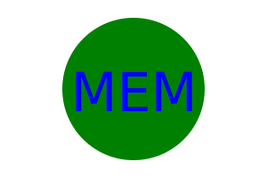

# Logo-Maker

## Description
The goal of this Logo-Maker is to demonstrate what I have learned about OOP (Object Oriented Programming), classes, inheritance, npms, and tests by building an application that allows the end user to easily create a variety of logos by answering a few prompted questions. Also, to show that the solution was tested during production before release.

### Specific Objectives
1. Create a command-line application that accepts user input
2. The application prompts the user to provide up to three characters for the text, a text color that can be given as a keyword or a hexadecimal number, and a shape color that can be given as a keyword or a hexadecimal number, as well as what shape the want from a list of three shape options.
3. Upon answering the prompts, an SVG file is created called "logo.svg" and the output text "Generated logo.svg" is printed out in the command line.
4. The logo.svg file can be opened in a browser and produces a 300x200 pixel image that matches the criteria entered by the user.

## Installation
After you clone the project, run nmp install.
Open a terminal inside the folder where you have cloned the repository.
In that command line, type "node index.js"

## Screenshot

## Walthrough Video

Please see the walkthrough video here:
https://drive.google.com/file/d/1bvhxu12R4Fq06XaqTOyANinc25eXVprj/view

If that video is too small on your computer, please follow this link:
https://app.screencastify.com/v3/watch/LX70zrEdgOEgmflTSF80